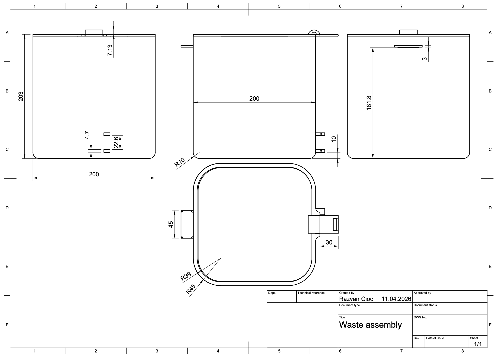
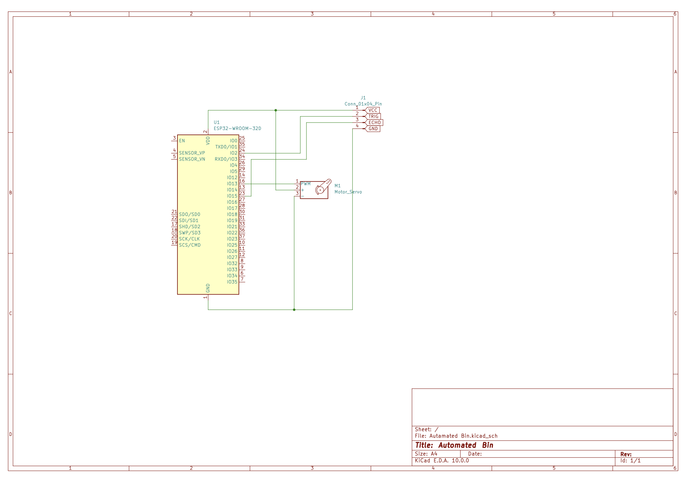

# SmartBin - Arduino Uno Based Autonomous Waste Management System

An automated, touchless waste disposal solution designed for hygiene and convenience. This project utilizes an **Arduino Uno microcontroller**, an **HC-SR04 ultrasonic sensor**, and a **PWM-controlled servo motor** to create a highly responsive, autonomous bin lid. 

This repository contains the C++ firmware, hardware schematics, and 3D-printable CAD files required to replicate the project.

---

## System Overview

The SmartBin minimizes physical contact with waste receptacles. By utilizing high-frequency ultrasonic distance measurement (40kHz), the system detects an approaching hand or object and triggers a servo motor to articulate the lid smoothly and silently.

### Key Features
* **Non-Blocking Proximity Logic:** Calibrated for a 30cm detection threshold.
* **Precision Actuation:** 25° angular displacement for optimal lid opening using the standard Arduino `Servo` library.
* **Low Latency:** Efficient ATmega328P processing ensures instantaneous response times.
* **Parametric Design:** Fully 3D-printable chassis and mounting brackets.

  

### Assembled Product

  
  
  

  
   
  <em>Click on the image to see the video.</em>

---

## Hardware Specifications

To build this project, you will need the following components:

| Component | Specification | Quantity |
| :--- | :--- | :--- |
| **Microcontroller** | Arduino Uno (Rev3) | 1 |
| **Sensor** | HC-SR04 Ultrasonic Sensor | 1 |
| **Actuator** | SG90 or MG90S Micro Servo | 1 |
| **Power Source** | 5V DC Supply / USB | 1 |
| **Enclosure** | 3D Printed Parts (See `/cad`) | 1 |

### Hardware Configuration (I/O Mapping)

| Component | Arduino Pin | Wire Color | Function |
| :--- | :--- | :--- | :--- |
| **HC-SR04 Trig** | Digital Pin 2 | Yellow/White | Ultrasonic Pulse Trigger |
| **HC-SR04 Echo** | Digital Pin 3 | Green/Blue | Pulse Echo Return |
| **Servo Signal** | Digital Pin 9 (~PWM) | Orange | PWM Control Signal |
| **VCC (All)** | 5V | Red | System Power (5V) |
| **GND (All)** | GND | Black/Brown | Common Ground |

  

---

## Installation & Setup

### 1. Mechanical Assembly (CAD)
All structural components are located in the `/cad` directory.
* **Fabrication:** 3D print the `.stl` files using PLA or PETG.
* **Settings:** 0.2mm layer height, 3 wall perimeters, 20% Infill.
* **Servo Mounting:** Ensure the servo is at its `baseAngle` (0°) during assembly.

### 2. Circuitry & Wiring
Refer to the I/O Mapping table. Ensure all grounds (GND) are common to avoid signal noise.

### 3. Firmware Deployment
The system is built using the standard Arduino framework.

1. **Environment:** Open the project in **Arduino IDE**.
2. **Library:** Uses the built-in `<Servo.h>` library.
3. **Upload:** Connect Arduino Uno, select the correct COM port, and flash the code.
4. **Baud Rate:** Set Serial Monitor to **9600 baud** for telemetry.

### 4. Mechanical Linkage
1. **Material:** 1.5mm rigid steel wire or a heavy-duty paperclip.
2. **Linkage:** Connect the servo horn to the lid attachment point.
3. **Calibration:** - Servo at 90° = Lid Closed.
   - Servo at 65° (25° displacement) = Lid Open.

> [!TIP]
> Use a "Z-bend" at both ends of the wire to ensure the linkage remains secure during repeated cycles.
